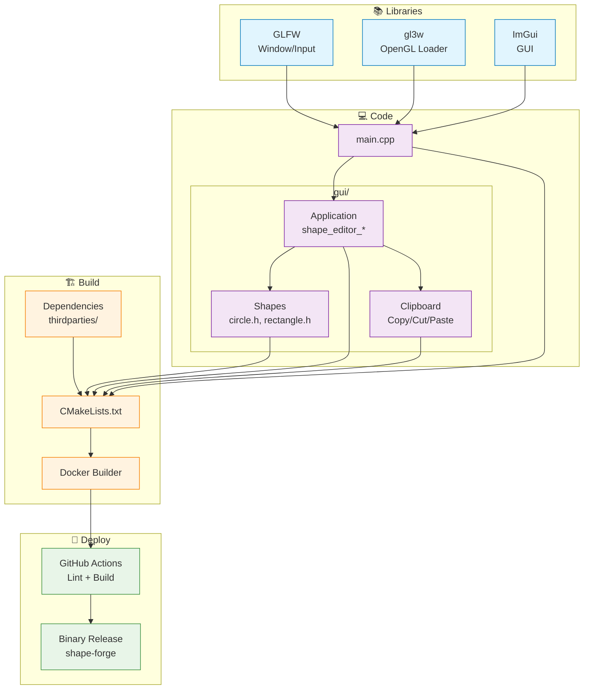

# Project Overview

## Description

**ShapeForge** is a C++ learning project that demonstrates how to integrate **Dear ImGui**, **GLFW**, and **gl3w** using modern C++ idioms. The focus is on architecture, build tooling, and immediate-mode GUI workflows — not game engines or physics simulation.

The project is packaged with:

- A portable Docker-based build environment  
- CMake-based builds for both Linux and Windows  
- GitHub Actions pipelines for CI/CD (build, lint, release)


Physics or external engines are intentionally excluded to focus on **build tooling**, **architecture**, and **interaction design**.

## Features
- 🖱️ **Drag & Drop Shapes**: Move circles and rectangles interactively using your mouse  
- 🔁 **Change Shape Type**: Switch between shape types via the UI  
- 🧱 **Boundary Clamping**: Shapes cannot be moved outside the canvas region  
- 🔍 **Cursor Feedback**: Cursor changes visually when hovering or interacting with shapes  
- 🧩 **Context Menu Actions**: Right-click to Copy, Cut, Paste, or Delete selected shapes
- 🛠 **Cross-platform Build System**: Uses CMake + Docker for reproducible builds  
- 🤖 **GitHub Actions CI**: Linting, build checks, and automated release  
- ✅ **Super-Linter**: Ensures code quality and style consistency across commit

## Video Demo

https://github.com/user-attachments/assets/9a60f48f-2f43-40c7-a15b-4e65b49aec80

---

## Project flow



## Design

### Dependency

- Modern C++ standard used for type safety, structured bindings, and RAII  
- **CMake:** Cross-platform build system  
- **ImGui:** GUI library - v1.90.1  
- **GLFW:** Windowing and input - v3.4  
- **gl3w:** OpenGL function loader

### Core Libraries

#### GLFW

- **Purpose:** Cross-platform window creation and input handling  
- **Provides:** Window management, OpenGL context creation, keyboard/mouse events  
- **Why Needed:** Abstracts OS-specific windowing APIs for Linux, Windows, and macOS

#### gl3w

- **Purpose:** OpenGL function loader  
- **Provides:** Runtime loading of modern OpenGL functions  
- **Why Needed:** Modern OpenGL requires explicit function pointer loading at runtime

#### Dear ImGui

- **Purpose:** Immediate-mode GUI library  
- **Provides:** UI widgets (buttons, windows, input fields) rendered via OpenGL  
- **Why Needed:** Enables UI elements like map controls and coordinate displays

### How They Work Together

```
GLFW   → Creates window + OpenGL context  
gl3w   → Loads OpenGL functions for that context  
ImGui  → Uses loaded OpenGL functions to render the UI  
```

**Flow:**  
- **GLFW** manages the window and input  
- **gl3w** loads OpenGL functions  
- **ImGui** renders UI using those functions  
- The application renders map tiles in the same OpenGL context  

**Backends:**  
`imgui_impl_glfw.cpp` and `imgui_impl_opengl3.cpp` bridge ImGui with GLFW and OpenGL, respectively.

---

## Compiling

### Linux

To download and extract dependencies:

```bash
docker run --rm -it -v "$(pwd)":/home/dev/app ghcr.io/hung-truongqc/shape_forge_builder:latest bash -c "rm -r thirdparties; ./download_and_setup_dependencies.sh"
```

### Build Commands

The build process uses the `BUILD_RELEASE` flag (default: release mode).

#### Release Mode

```bash
docker run --rm -it -v "$(pwd)":/home/dev/app ghcr.io/hung-truongqc/shape_forge_builder:latest bash -c "rm -r build && mkdir build && cd build && cmake .. && cmake --build ."
```

#### Debug Mode

To debug on your host machine, add this to `.gdbinit`:

```
set substitute-path /home/dev/app <YOUR_PROJECT_PATH>
```

Then build with:

```bash
docker run --rm -it -v "$(pwd)":/home/dev/app ghcr.io/hung-truongqc/shape_forge_builder:latest bash -c "rm -r build && mkdir build && cd build && cmake .. -DBUILD_RELEASE=OFF && cmake --build ."
```

---

### Windows

TBD

---

## Usage (Linux)

After building on Linux using Docker, or downloading the binary from the release tag, you can run the application like this


```bash
./shape-forge 
```
Note: You’ll need to manually add execute permissions. This is intentional the distributed binary does not have executable rights by default.

### Controls

- Use the **GUI panel** to:
  - Create and select shapes
  - Move shapes using mouse drag
  - View and edit shape properties

### Notes

- This binary is built inside a Docker container with OpenGL support.  
- Ensure your host system allows OpenGL passthrough from Docker (e.g., using `-v /tmp/.X11-unix:/tmp/.X11-unix` and `-e DISPLAY=$DISPLAY`).
- The UI is rendered using Dear ImGui within the OpenGL context  
- Debug mode provides better symbol mapping for GDB when using Docker  
- The canvas runs in a single OpenGL context shared by both GUI and rendering layers
