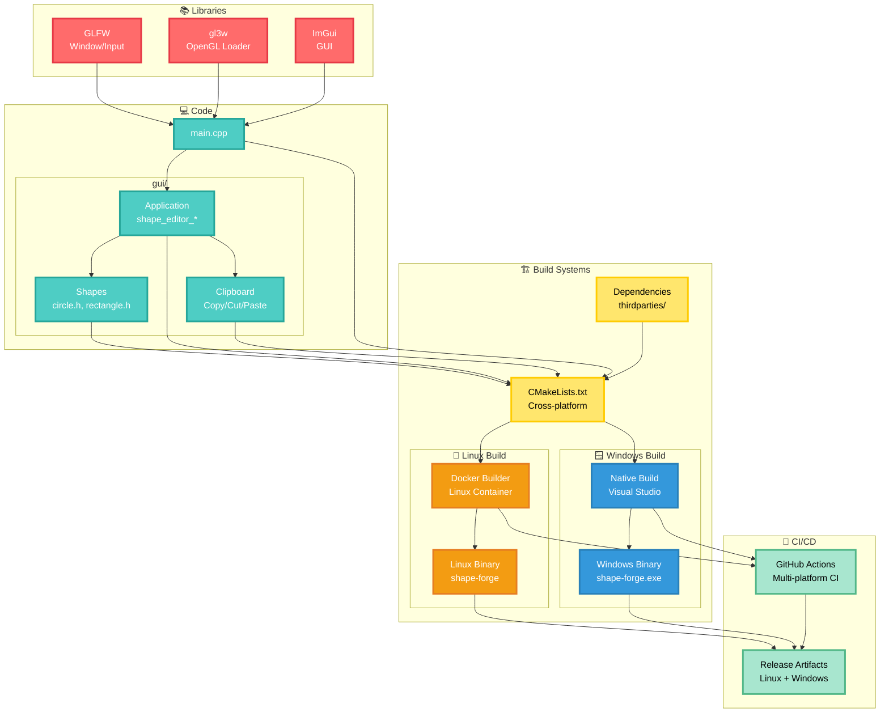

# ShapeForge

## Overview

**ShapeForge** is a C++ learning project that demonstrates how to integrate **Dear ImGui**, **GLFW**, and **gl3w** using modern C++ idioms. The focus is on architecture, build tooling, and immediate-mode GUI workflows — not game engines or physics simulations.

The project has **full support for both Windows and Linux**, packaged with:

- A portable Docker-based build environment  
- CMake-based builds for both platforms  
- GitHub Actions pipelines for CI/CD (build, lint, release)

Physics engines or external game engines are intentionally excluded to focus on **build tooling**, **software architecture**, and **interaction design**.

## Features

- 🖱️ **Drag & Drop Shapes**: Move circles and rectangles interactively with your mouse  
- 🔁 **Shape Type Switching**: Change between different shape types via the UI  
- 🧱 **Boundary Clamping**: Shapes cannot be moved outside the canvas region  
- 🔍 **Visual Cursor Feedback**: Cursor changes when hovering over or interacting with shapes  
- 🧩 **Context Menu Actions**: Right-click to Copy, Cut, Paste, or Delete selected shapes  
- 🛠 **Cross-platform Build System**: Uses CMake + Docker for reproducible builds  
- 🤖 **GitHub Actions CI**: Automated linting, build checks, and releases  
- ✅ **Code Quality Assurance**: Super-Linter ensures code quality and style consistency

## Video Demo

https://github.com/user-attachments/assets/9a60f48f-2f43-40c7-a15b-4e65b49aec80

---

## Project Architecture



## Technical Design

### Dependencies

- **Modern C++**: Utilizes modern C++ standards for type safety, structured bindings, and RAII principles  
- **CMake**: Cross-platform build system  
- **ImGui**: Immediate-mode GUI library - v1.90.1  
- **GLFW**: Windowing and input handling - v3.4  
- **gl3w**: OpenGL function loader

### Core Libraries

#### GLFW

- **Purpose**: Cross-platform window creation and input handling  
- **Provides**: Window management, OpenGL context creation, keyboard/mouse events  
- **Why Needed**: Abstracts OS-specific windowing APIs for Linux, Windows, and macOS

#### gl3w

- **Purpose**: OpenGL function loader  
- **Provides**: Runtime loading of modern OpenGL functions  
- **Why Needed**: Modern OpenGL requires explicit function pointer loading at runtime

#### Dear ImGui

- **Purpose**: Immediate-mode GUI library  
- **Provides**: UI widgets (buttons, windows, input fields) rendered via OpenGL  
- **Why Needed**: Enables interactive UI elements like shape controls and property panels

### Library Integration

```
GLFW   → Creates window + OpenGL context  
gl3w   → Loads OpenGL functions for that context  
ImGui  → Uses loaded OpenGL functions to render the UI  
```

**Workflow**:  
1. **GLFW** manages the window and handles input events  
2. **gl3w** loads OpenGL functions for the current context  
3. **ImGui** renders the user interface using those OpenGL functions  
4. The application renders shapes in the same OpenGL context  

**Backend Integration**:  
`imgui_impl_glfw.cpp` and `imgui_impl_opengl3.cpp` provide the bridge between ImGui and GLFW/OpenGL respectively.

---

## Building the Project

### Linux

#### Download Dependencies

```bash
docker run --rm -it -v "$(pwd)":/home/dev/app ghcr.io/hung-truongqc/shape_forge_builder:latest bash -c "rm -rf thirdparties; ./download_and_setup_dependencies.sh"
```

#### Build Commands

The build process uses the `BUILD_RELEASE` flag (defaults to release mode).

##### Release Mode

```bash
docker run --rm -it -v "$(pwd)":/home/dev/app ghcr.io/hung-truongqc/shape_forge_builder:latest bash -c "rm -rf build && mkdir build && cd build && cmake .. && cmake --build ."
```

##### Debug Mode

For debugging on your host machine, add this line to your `.gdbinit`:

```
set substitute-path /home/dev/app <YOUR_PROJECT_PATH>
```

Then build with:

```bash
docker run --rm -it -v "$(pwd)":/home/dev/app ghcr.io/hung-truongqc/shape_forge_builder:latest bash -c "rm -rf build && mkdir build && cd build && cmake .. -DBUILD_RELEASE=OFF && cmake --build ."
```

### Windows

#### Download Dependencies

```cmd
rm -r thirdparties
./download_and_setup_dependencies.bat
```

#### Build Commands

##### Release Mode

```cmd
cd build
cmake ..
cmake --build . --config Release
```

##### Debug Mode

For debugging, start Visual Studio and point it to the project inside the "build" folder after running:

```cmd
cd build
cmake .. -DBUILD_RELEASE=OFF
cmake --build .
```

---

## Running the Application

### Windows

After building or downloading the binary from the release page:

```cmd
./shape-forge.exe
```

### Linux

After building with Docker:

```bash
./shape-forge
```

### Controls

- Use the **GUI panel** to:
  - Create new shapes
  - Select and modify existing shapes
  - Drag shapes around the canvas with your mouse
  - View and edit shape properties in real-time

### Platform Notes

#### Linux
- The binary is built inside a Docker container with OpenGL support
- Ensure your host system allows OpenGL passthrough from Docker (use `-v /tmp/.X11-unix:/tmp/.X11-unix` and `-e DISPLAY=$DISPLAY` for X11 forwarding)
- The UI is rendered using Dear ImGui within the OpenGL context
- Debug mode provides better symbol mapping for GDB when using Docker
- The canvas operates in a single OpenGL context shared by both GUI and rendering layers

#### Windows
- **Full Windows support** with native builds
- If running on a virtual machine without GPU passthrough and appropriate OpenGL drivers, the application may fail to start
- For VM environments, install a software OpenGL driver such as [Mesa3D for Windows](https://github.com/pal1000/mesa-dist-win/releases)
- Native Windows builds do not require Docker
- Please note that installing Visual Studio Build Tools using "download_and_setup_dependencies.bat" may not fully install it. Therefore, it is suggested that if any warning messages about Visual Studio Build Tools integrity checks appear, please proceed to install it manually

---

## Platform Support

✅ **Windows**: Fully supported with native CMake builds and Visual Studio integration  
✅ **Linux**: Fully supported with Docker-based builds and X11 integration  

Both Windows and Linux platforms have been thoroughly tested and include automated CI/CD pipelines for continuous integration.1

# Planned Features

## Shape Additions
- **Triangle shapes**: Add support for various triangle types (equilateral, isosceles, scalene)
- **Hexagon shapes**: Regular and irregular hexagon support  
- **Shape editing tool**: Bezier curve editor or vertex manipulation tool for modifying existing shapes

## User Interface Improvements
- **Multi-select objects**: Enable selection and manipulation of multiple shapes simultaneously
- **Group operations**: Group/ungroup selected objects for batch operations

## Platform Support
- **Extend to macOS**: Full macOS compatibility with native build support

## Advanced Features
- **3D object rendering**: Add support for basic 3D shapes and rendering capabilities

---