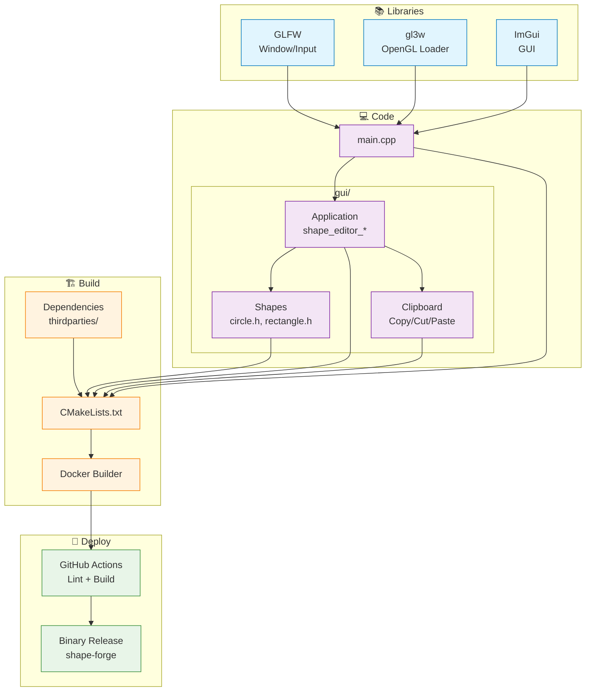

```mermaid
graph TD
    %% Libraries
    subgraph "📚 Libraries"
        GLFW["GLFW<br/>Window/Input"]
        GL3W["gl3w<br/>OpenGL Loader"]
        IMGUI["ImGui<br/>GUI"]
    end

    %% Code
    subgraph "💻 Code"
        MAIN["main.cpp"]
        subgraph "gui/"
            SHAPES["Shapes<br/>circle.h, rectangle.h"]
            APP["Application<br/>shape_editor_*"]
            CLIPBOARD["Clipboard<br/>Copy/Cut/Paste"]
        end
    end

    %% Build
    subgraph "🏗️ Build"
        CMAKE["CMakeLists.txt"]
        DOCKER["Docker Builder"]
        DEPS["Dependencies<br/>thirdparties/"]
    end

    %% Deploy
    subgraph "🚀 Deploy"
        CI["GitHub Actions<br/>Lint + Build"]
        RELEASE["Binary Release<br/>shape-forge"]
    end

    %% Flow
    GLFW --> MAIN
    GL3W --> MAIN
    IMGUI --> MAIN
    MAIN --> APP
    APP --> SHAPES
    APP --> CLIPBOARD
    
    CMAKE --> DOCKER
    DEPS --> CMAKE
    SHAPES --> CMAKE
    APP --> CMAKE
    CLIPBOARD --> CMAKE
    MAIN --> CMAKE
    
    DOCKER --> CI
    CI --> RELEASE

    %% Styling
    classDef lib fill:#e1f5fe,stroke:#0277bd
    classDef code fill:#f3e5f5,stroke:#7b1fa2
    classDef build fill:#fff3e0,stroke:#f57c00
    classDef deploy fill:#e8f5e8,stroke:#388e3c

    class GLFW,GL3W,IMGUI lib
    class MAIN,SHAPES,APP,CLIPBOARD code
    class CMAKE,DOCKER,DEPS build
    class CI,RELEASE deploy
```